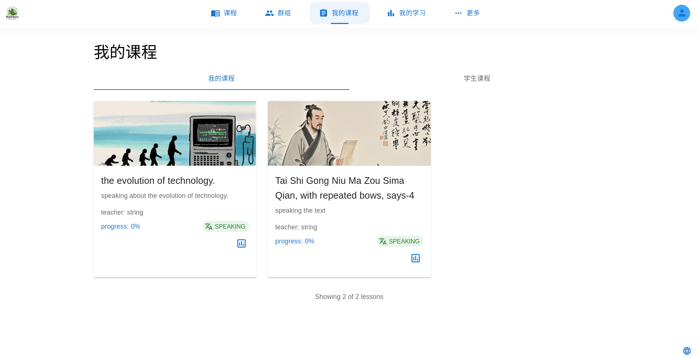
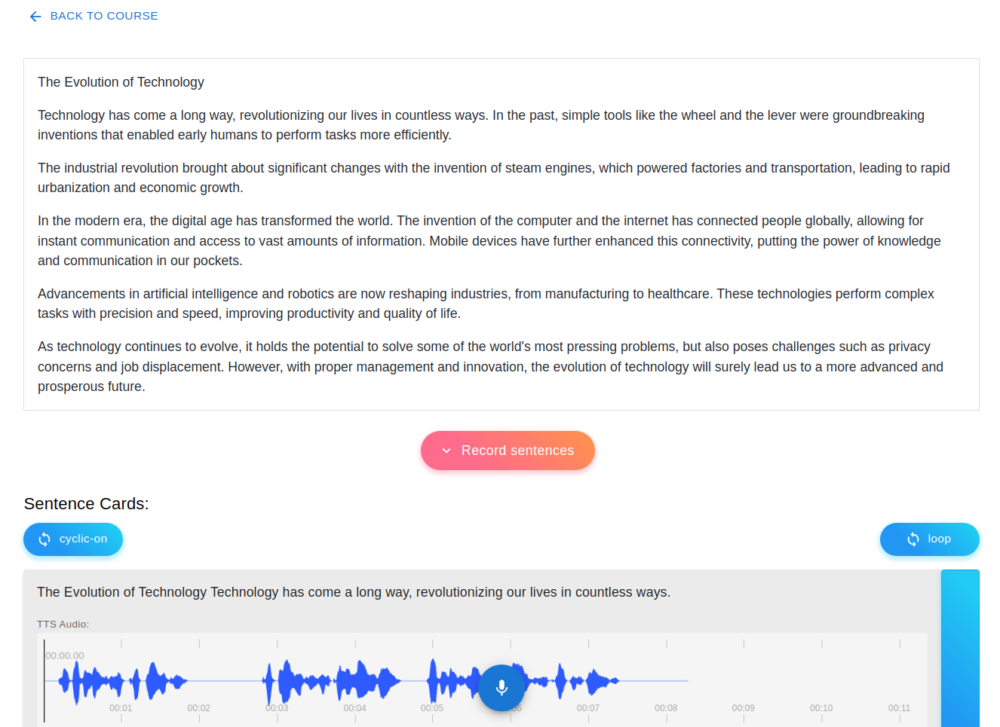

## Bamboo Growth学习管理系统

## 项目描述
课程管理系统是一个创新型平台，旨在提升教师和学生的教育体验。这个开源项目提供了一整套全面的工具，能让教育工作者创建自定义课程类型、管理学生的学习情况并开展评估工作。对于学生而言，它具备课程学习、做笔记以及学习路径分析等功能。该系统支持多种预设课程类型，包括编程、英语朗读、英语配音、书籍阅读以及通用课程。



## 核心功能
- **针对教师：**
  - 创建自定义课程类型。
  - 管理学生的课程学习情况。
  - 开展评估工作。

- **针对学生：**
  - 获取课程学习资料。
  - 使用笔记功能。
  - 记录并分析学习路径。

- **定制化：**
  - 针对不同课程类型设计并定制学习页面。

## 技术栈
- **前端：**
  - React
  - Vite
  - Material UI
  - CodeMirror（Markdown代码编辑器）
  - Video.js（视频控制）
  - Peaks.js（音频可视化）

- **后端：**
  - Sanic（API框架）
  - JWT（认证）
  - asyncpg（数据库连接）
  - 腾讯对象存储（Tencent COS，文件存储）
  - Docker Compose（容器化）

## 入门指南
要在本地设置该项目，请按以下步骤操作：

1. **克隆仓库：**
   ```bash
   git clone https://github.com/codeslips/bamboo_growth.git
   cd bamboo_growth
   ```

2. **安装依赖项：**
   对于前端：
   ```bash
   cd frontend
   yarn
   ```

   对于后端：
   ```bash
   cd backend
   pip install -r requirements.txt
   ```

3. **运行应用程序：**
   启动前端：
   ```bash
   yarn dev
   ```

   启动后端：
   ```bash
   python app.py
   ```

4. **访问应用程序：**
   打开浏览器并访问 `http://localhost:3000` 以进入前端页面。

## 特色
- 可定制的课程类型，带来多样化学习体验。
- 集成了用于学生评估和成绩跟踪的工具。
- 为教师和学生提供了用户友好型界面。



## 许可证
MIT License。 